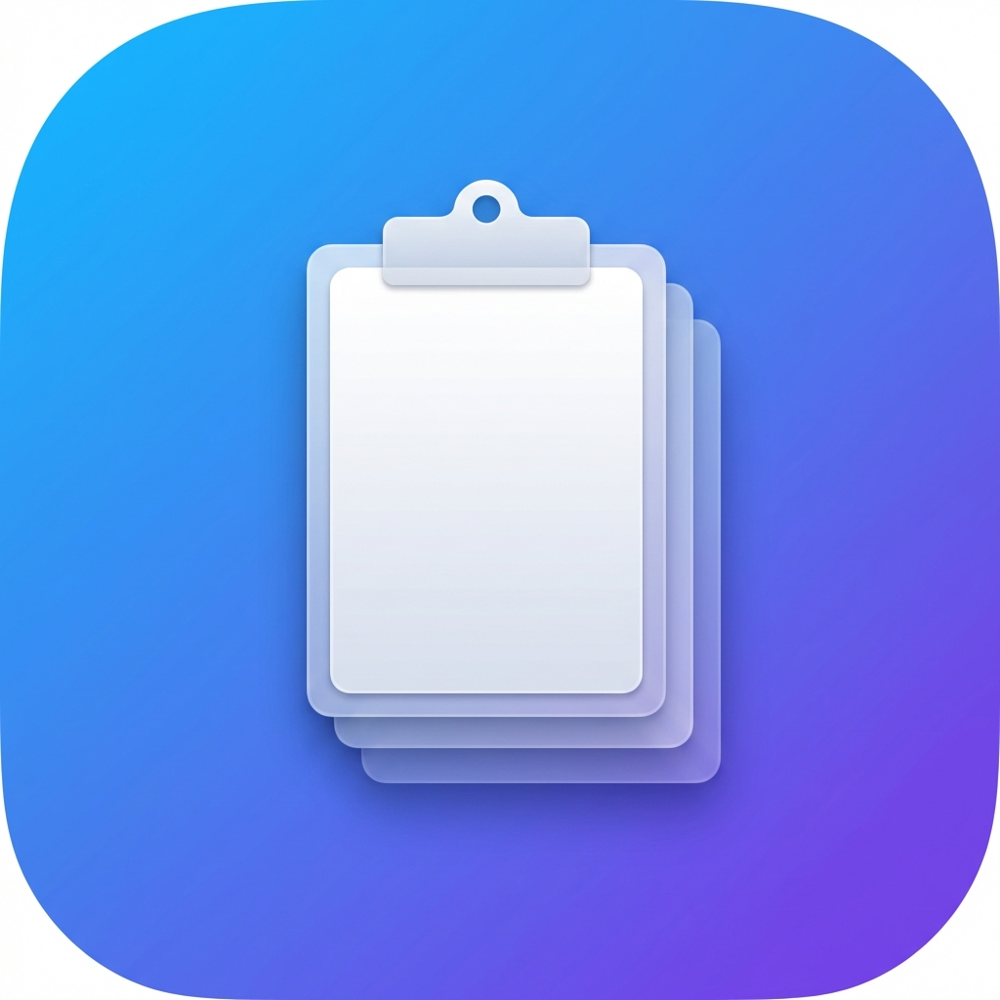

#  Stash

A lightweight macOS clipboard history manager that lives in your menu bar. Captures text, rich text, images, URLs, and file paths with zero dependencies.

Built with Swift 6 (strict concurrency), SwiftUI, SwiftData, and AppKit. Requires macOS 14+.

## Features

- **Clipboard monitoring** -- polls the system pasteboard every 0.5s and captures all content types
- **Menu bar popover** -- click the clipboard icon to see your 10 most recent entries
- **Spotlight-like search panel** -- press **Cmd+Shift+V** to open a floating panel with full-text search and content type filters
- **Quick select** -- press **Cmd+1** through **Cmd+9** to instantly paste an entry by position
- **Animated capture feedback** -- the menu bar icon flashes when a new entry is recorded
- **Password manager filtering** -- automatically skips entries from 1Password, KeePassXC, and other apps that mark clipboard content as concealed or transient
- **App exclusion** -- block specific apps from being recorded by bundle ID
- **Consecutive dedup** -- identical back-to-back copies are stored once
- **Pinned entries** -- pinned entries are protected from history limit pruning
- **Rich text paste** -- pastes RTF content with a plain text fallback for maximum compatibility
- **Launch at login** -- uses the modern `SMAppService` API
- **No external dependencies** -- pure Apple frameworks (AppKit, SwiftUI, SwiftData)

## Install

**Prerequisites:**

| Requirement | Minimum |
|---|---|
| macOS | 14.0 (Sonoma) |
| Xcode | 16.0 |
| XcodeGen | 2.38 |

**Build:**

```sh
brew install xcodegen     # if not installed
cd Stash
xcodegen generate
open Stash.xcodeproj      # build and run with Cmd+R
```

Or build from the command line:

```sh
cd Stash
xcodegen generate
xcodebuild -scheme Stash -configuration Debug build
```

On first launch, macOS will prompt for **Accessibility** permission (System Settings > Privacy & Security > Accessibility). This is required for the global **Cmd+Shift+V** hotkey. Restart the app after granting access.

## Usage

### Menu Bar

Click the clipboard icon in the menu bar to open a popover showing your recent clipboard entries. Each entry shows:

- Content type icon (text, rich text, image, file, URL)
- Preview text (up to 2 lines)
- Source app name and relative timestamp

Click any entry to place it on the clipboard. Use the **Pause** toggle to temporarily stop recording.

### Search Panel

Press **Cmd+Shift+V** anywhere to open the floating search panel.

| Key | Action |
|---|---|
| Type | Filter entries by text |
| Up/Down | Navigate entries |
| Return | Paste selected entry |
| Escape | Dismiss panel |
| Cmd+1-9 | Quick-select by position |

Filter chips at the top let you narrow results by content type: All, Text, Rich, Images, Files, URLs.

### Settings

Access via the app menu (Cmd+,). Configurable options:

| Setting | Default | Range |
|---|---|---|
| History limit | 500 | 10 - 10,000 entries |
| Polling interval | 0.5s | 0.1 - 5.0s |
| Launch at login | Off | -- |
| Excluded apps | None | Bundle IDs |

## Privacy

Stash automatically skips clipboard content marked with privacy indicators:

- `org.nspasteboard.ConcealedType` (industry standard)
- `org.nspasteboard.TransientType` (transient content)
- `org.nspasteboard.AutoGeneratedType` (auto-fill)
- 1Password and KeePassXC-specific markers

You can also exclude specific apps entirely from recording via Settings.

The app is **not sandboxed** and stores clipboard history locally via SwiftData. Image and rich text blobs are stored as external files on disk. No data is sent to any server.

## Architecture

```
NSPasteboard.general (polled every 0.5s)
    |
ClipboardMonitor -- detect change, filter, classify, extract
    |
AppController -- orchestrates all services
    |
StorageManager -- SwiftData persistence, dedup, history limits
    |
MenuBarView / SearchView -- observe StorageManager.changeCount
    |
PasteService -- write entry back to pasteboard
```

**AppController** (`@MainActor @Observable`) owns all services and wires them together with closures. All services run on the main actor (required by SwiftData's `ModelContext` and AppKit's `NSPasteboard`).

The app uses a custom `NSStatusItem` + `NSPopover` rather than SwiftUI's `MenuBarExtra` to support animated icon transitions and live-updating views.

## Project Structure

```
Stash/
├── project.yml                 # XcodeGen configuration (source of truth)
├── Stash/
│   ├── StashApp.swift          # Entry point + AppController
│   ├── Model/
│   │   ├── ClipboardEntry.swift    # SwiftData model
│   │   └── ContentType.swift       # Content type enum + detection
│   ├── Services/
│   │   ├── ClipboardMonitor.swift  # Pasteboard polling
│   │   ├── StorageManager.swift    # SwiftData persistence
│   │   ├── PasteService.swift      # Paste-from-history
│   │   └── HotkeyManager.swift     # Global hotkey (Cmd+Shift+V)
│   ├── Views/
│   │   ├── MenuBarView.swift       # Menu bar popover content
│   │   ├── SearchView.swift        # Spotlight-like search panel
│   │   ├── EntryRowView.swift      # Clipboard entry row
│   │   └── SettingsView.swift      # Preferences UI
│   ├── Panel/
│   │   ├── FloatingPanel.swift     # NSPanel subclass
│   │   └── PanelController.swift   # Panel lifecycle
│   └── Support/
│       ├── Preferences.swift       # UserDefaults wrapper
│       └── PasteboardConstants.swift
└── StashTests/                 # 65 tests across 6 files
    ├── Model/
    ├── Services/
    └── Support/
```

## Testing

```sh
cd Stash
xcodebuild test -scheme Stash -destination 'platform=macOS'
```

Or press Cmd+U in Xcode. Tests use in-memory SwiftData containers and named pasteboards for isolation.

## Versioning

Stash uses calendar versioning: **YYYY.M.PATCH**

- `YYYY` -- release year
- `M` -- release month (unpadded)
- `PATCH` -- incremental patch within the month, starting at 0

Examples: `2026.2.0`, `2026.2.1`, `2026.12.0`

The build number (`CFBundleVersion`) is an incrementing integer independent of the version string.

## License

MIT
